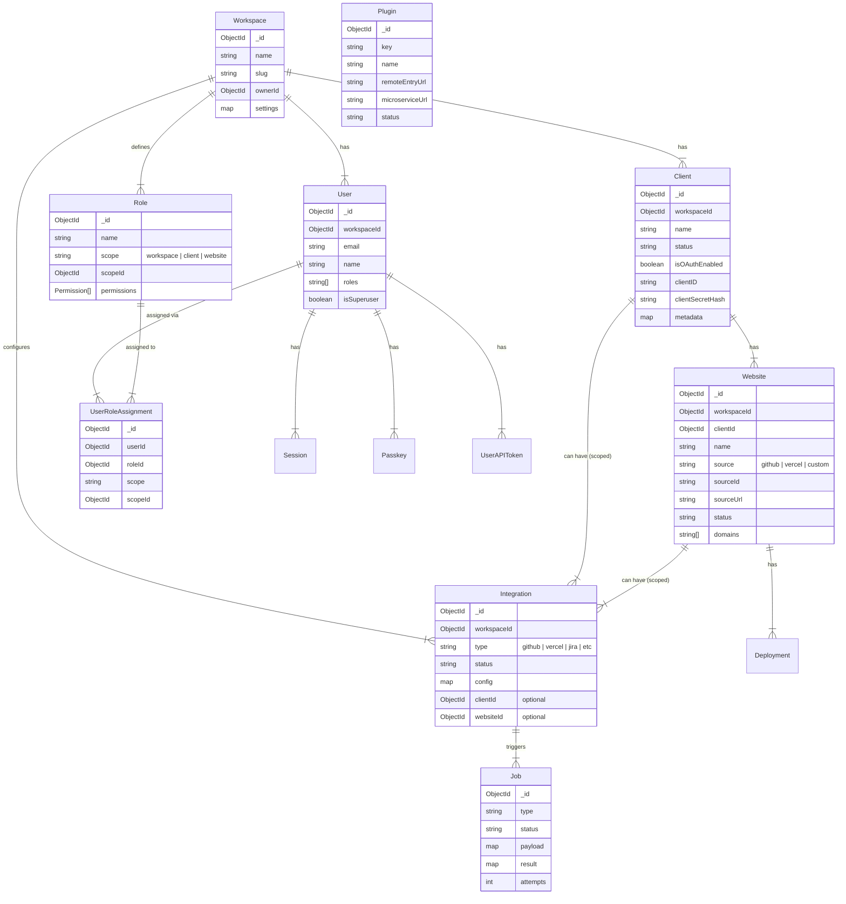

# Motherboard Project Schema Map

This document outlines the data models and their relationships within the `Motherboard-server` project.

## Core Hierarchy

The data model follows a hierarchical structure:
[Workspace](file:///Users/rupali.b/Documents/GitHub/Motherboard/Motherboard-server/internal/models/workspace.go#8-21) (Tenant) -> [Client](file:///Users/rupali.b/Documents/GitHub/Motherboard/Motherboard-server/internal/models/client.go#4-29) -> [Website](file:///Users/rupali.b/Documents/GitHub/Motherboard/Motherboard-server/internal/models/website.go#20-54) (Project)

- **Workspace**: The top-level tenant (e.g., "Motherboard Root"). All other entities belong to a workspace.
- **Client**: A customer or entity that owns projects (e.g., "ChoudharyTransport").
- **Website**: A specific project or application (e.g., "Motherboard-server", "Jira_tracker").

## Entity Relationship Diagram (ERD)

## Detailed Models

### Workspace (Root)
- **Collection**: `workspaces`
- **Purpose**: Multi-tenancy root.
- **Key Fields**: [Name](file:///Users/rupali.b/Documents/GitHub/Motherboard/Motherboard-server/internal/services/workspace/workspace.go#151-164), [Slug](file:///Users/rupali.b/Documents/GitHub/Motherboard/Motherboard-server/internal/services/workspace/workspace.go#165-182), `OwnerID`, `Settings`.

### Client
- **Collection**: `clients`
- **Parent**: [Workspace](file:///Users/rupali.b/Documents/GitHub/Motherboard/Motherboard-server/internal/models/workspace.go#8-21)
- **Purpose**: Represents a customer or organizational unit.
- **Key Fields**: [Name](file:///Users/rupali.b/Documents/GitHub/Motherboard/Motherboard-server/internal/services/workspace/workspace.go#151-164), [Status](file:///Users/rupali.b/Documents/GitHub/Motherboard/Motherboard-server/internal/models/job.go#25-26), `Metadata` (stores source path), `OAuth` credentials.

### Website (Project)
- **Collection**: `websites`
- **Parent**: [Client](file:///Users/rupali.b/Documents/GitHub/Motherboard/Motherboard-server/internal/models/client.go#4-29)
- **Purpose**: Represents a specific software project or deployment.
- **Key Fields**: [Name](file:///Users/rupali.b/Documents/GitHub/Motherboard/Motherboard-server/internal/services/workspace/workspace.go#151-164), [Source](file:///Users/rupali.b/Documents/GitHub/Motherboard/Motherboard-server/internal/models/website.go#8-9) (GitHub/Vercel/Custom), `SourceURL`, `Domains`.

### User
- **Collection**: `users`
- **Parent**: [Workspace](file:///Users/rupali.b/Documents/GitHub/Motherboard/Motherboard-server/internal/models/workspace.go#8-21) (Users are scoped to a workspace).
- **Key Fields**: `Email`, [Name](file:///Users/rupali.b/Documents/GitHub/Motherboard/Motherboard-server/internal/services/workspace/workspace.go#151-164), `Roles` (simple strings), `IsSuperuser`.

### Access Control (RBAC)
- **Role**: Defines a set of permissions (`Resource` + `Actions`). Scoped to `workspace`, `client`, or `website`.
- **UserRoleAssignment**: Links a [User](file:///Users/rupali.b/Documents/GitHub/Motherboard/Motherboard-server/internal/models/user.go#4-29) to a [Role](file:///Users/rupali.b/Documents/GitHub/Motherboard/Motherboard-server/internal/models/role.go#14-32) at a specific `ScopeID`.

### Integrations
- **Collection**: `integrations`
- **Purpose**: Third-party connections (GitHub, Vercel, Jira, Twilio, etc.).
- **Scope**: Can be Global (Workspace), Client-level, or Website-level.

### Jobs
- **Collection**: `jobs`
- **Purpose**: Async background tasks (Syncing repos, Processing webhooks).
- **Key Fields**: [Type](file:///Users/rupali.b/Documents/GitHub/Motherboard/Motherboard-server/internal/models/job.go#11-12), [Status](file:///Users/rupali.b/Documents/GitHub/Motherboard/Motherboard-server/internal/models/job.go#25-26), `Payload`, `Result`.
