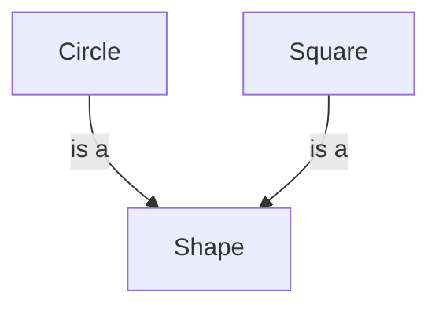
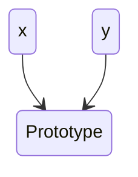
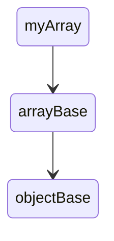

### Getting Started
4 Pillars of OOP
1. Encapsulation
2. Abstraction
3. Inheritance
4. Polymorphism

# Objects
1. Object literal syntax: `eg- const circle={};` which has key value pairs.
2. Functions of a class are called `methods`, variables are called `properties`.

### Factories & Constructor
1. Object literal syntax are not the correct way to duplicate an object, if it has atleast 1 method.
2. If there are methods, they are called `behavior`. Solution is to use a `factory` or `constructor` function.
3. `Factory`: If we return an object.
4. `Constructor`: if we use `this` and `new`
5. Every object has a constructor property which was used to create that object.
6. Functions are internally objects declared internally as `new Function()`. It has 3 methods:-
	1. `call()`
	2. `apply()`
	3. `bind()`

### Enumerating Objects
1. `for...in` loop
2. Only the properties? `typeof != function`
3. `Object.keys()`
4. prop `in` object

# Abstraction
Hide the details, show only the essentials
1. Use `local` variables - making use of `closures` and `scope`. Scope is temporary, closures are permanent.
2. Use `getters & setters` to read and modify private properties
3. Use `Object.defineProperties(this, variable, get:function(){, set: function(){}});`

# Prototypes
## Inheritance
- Object takes on the properties and methods of another object
Example: 





- `Object.getPrototpeOf(x)`
- **PROTOTYPICAL INHERITANCE**: To find a property or method in an object, it first the object, then parent, till the root object (ie, objectbase)
- MULTILEVEL INHERITANCE: 

- Objects created by a given constructor will have the same prototype.

## Property Descriptors
- There are 3 attributes which can be set for any object property:-
	- `configurable`
	- `enumerable`
	- `writable`
- To get the values of these attributes, you can use - `Object.getOwnPropertyDescriptor(Object.getPrototype(object))`
- To set the attributes of these properties, use
		``` Object.defineProperty(object, "property",{
		writable: false,
		});
		```
	